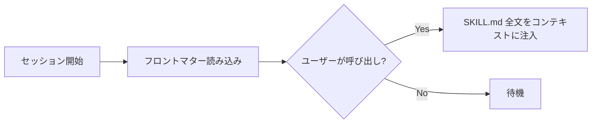

# ai-instructions

AI コーディングエージェント向けのカスタムスキルコレクション。
Claude Code / Copilot CLI 等のスキル対応エージェントで利用できる。
複数端末で共有するため、プライベートリポジトリとして管理している。

## 目次

- [概要](#概要)
- [スキル一覧](#スキル一覧)
- [セットアップ](#セットアップ)
- [リポジトリ構成](#リポジトリ構成)
- [スキルの追加・編集](#スキルの追加編集)

## 概要

各スキルは AI エージェントのセッション開始時に YAML フロントマターが読み込まれ、ユーザーがスキルを呼び出すとファイル全体がコンテキストとして提供される。



## スキル一覧

| スキル | 概要 |
|:---|:---|
| [agent-config](#agent-config) | AI エージェント設定ファイルの作成・編集ルール |
| [copilot-acp-direct](#copilot-acp-direct) | ライブラリなしで Python から Copilot CLI を ACP で直接呼び出す |
| [copilot-acp-library](#copilot-acp-library) | copilot-acp ライブラリ経由で Copilot CLI を API として利用 |
| [git-branch-bitbucket](#git-branch-bitbucket) | Bitbucket 環境での Git ブランチ作成・プッシュの運用ルール |
| [git-safety](#git-safety) | Git 操作（ステージング・コミット・プッシュ）の安全ルール |
| [html-generator](#html-generator) | ドキュメントを高品質な HTML に変換（Markdown・PDF・Word 等対応） |
| [jira-mcp-operations](#jira-mcp-operations) | Jira MCP サーバーによるチケット CRUD 操作 |
| [jira-mcp-setup](#jira-mcp-setup) | Jira MCP サーバーの設定・トラブルシューティング |
| [markdown-generator](#markdown-generator) | README・議事録・WBS・メモ等の種別対応 Markdown 生成 |
| [mcp-server-config](#mcp-server-config) | MCP サーバーの設定・管理 |
| [outlook-powershell](#outlook-powershell) | PowerShell COM による Outlook メール操作（軽量処理向け） |
| [outlook-python](#outlook-python) | Python COM（pywin32）による Outlook メール操作（大量処理・分析向け） |
| [skill-authoring](#skill-authoring) | スキルの作成・更新・管理ルール |

---

### agent-config

AI エージェント設定ファイル（AGENTS.md, CLAUDE.md, .cursorrules 等）の作成・編集ガイド。  
設定ファイルは 50 行以内に保ち、長いルールはスキルへの分離を推奨する。

### copilot-acp-direct

`subprocess` + JSON-RPC 2.0 で `copilot --acp --stdio` を直接呼び出すコピペ用 Python クラスを提供。  
pip install 不要、1 ファイルで完結する。

### copilot-acp-library

`pip install copilot-acp` で導入する `CopilotClient` クラスの使い方ガイド。  
シンプルチャット、インタラクティブモード、コードレビュー、マルチエージェントの 4 パターンを収録。

### git-branch-bitbucket

Bitbucket 環境での Git ブランチ作成・プッシュの運用ルール。  
Gitflow ブランチの作成禁止、保護ブランチへの直接 push 拒否など、安全な運用を定義。

### git-safety

エージェントが **自発的に git 操作を提案しない** ことを徹底する安全ルール。
Conventional Commits + JEAD（日本語・体言止め）のコミットメッセージ規約を定義。

### html-generator

ドキュメント（Markdown・PDF・テキスト・Word・Excel・PowerPoint）を高品質な HTML に変換するスキル。
議事録・レポート・比較資料・説明資料・WBS・ロードマップなど種別に応じたスケルトン HTML でレイアウトを統一する。

### jira-mcp-operations

10 種の Jira MCP ツール（課題作成・取得・更新・ステータス遷移・コメント追加等）の操作ガイド。  
検索・取得はサブエージェントに委任するトークン効率設計。

### jira-mcp-setup

Jira MCP サーバーの設定ファイルとトラブルシューティング手順。

> [!WARNING]
> 設定ファイル名は `~/.copilot/mcp-config.json` でなければならない（`mcp.json` は無視される）。

### markdown-generator

README、議事録、WBS・ガントチャート、メモ、図解ドキュメントなど種別に応じた構成テンプレートと、
GitHub Markdown Alerts・Mermaid 図解の共通ルールを提供する汎用 Markdown 生成スキル。

### mcp-server-config

MCP サーバー設定ファイルの構成・複数サーバー追加・管理コマンド・5 つのトラブルシューティングシナリオを網羅。

### outlook-powershell

PowerShell COM で Outlook のメール検索・作成・送信・返信・転送を自動化。  
Windows 標準環境のみで動作し、追加インストール不要。軽量な操作向け。

### outlook-python

Python COM（pywin32）で Outlook メールの大量検索・集計・分析・添付保存・日次レポートを実装。  
モジュール化されたスクリプト群（`lib/outlook_client.py`）を利用し、複雑なメール処理に対応。

### skill-authoring

スキルの新規作成・更新時の命名規則（kebab-case）、フロントマター、行数目安（200 行目標・400 行上限）を定義する。

## セットアップ

リポジトリをクローンし、利用する AI エージェントのスキルディレクトリにシンボリックリンクを作成する。

```powershell
# クローン
git clone https://github.com/<user>/ai-instructions.git

# 各スキルをシンボリックリンクで配置（管理者権限で実行）
# パスは利用するエージェントに合わせて変更（例: .claude\skills, .copilot\skills）
$skillsDir = "$env:USERPROFILE\.copilot\skills"
Get-ChildItem -Path .\ai-instructions -Directory | Where-Object { $_.Name -ne '.git' } | ForEach-Object {
    $target = "$skillsDir\$($_.Name)"
    if (-not (Test-Path $target)) {
        New-Item -ItemType SymbolicLink -Path $target -Target $_.FullName
    }
}
```

> [!TIP]
> シンボリックリンクを使うと、`git pull` だけで全端末のスキルを一括更新できる。
> スキルディレクトリのパスはエージェントにより異なる（例: `~/.claude/skills`, `~/.copilot/skills`）。

## リポジトリ構成

```
ai-instructions/
├── README.md
├── agent-config/
│   └── SKILL.md
├── copilot-acp-direct/
│   ├── SKILL.md
│   └── references/
├── copilot-acp-library/
│   └── SKILL.md
├── git-branch-bitbucket/
│   └── SKILL.md
├── git-safety/
│   └── SKILL.md
├── html-generator/
│   ├── SKILL.md
│   └── references/
├── jira-mcp-operations/
│   └── SKILL.md
├── jira-mcp-setup/
│   └── SKILL.md
├── markdown-generator/
│   ├── SKILL.md
│   └── references/
├── mcp-server-config/
│   └── SKILL.md
├── outlook-powershell/
│   ├── SKILL.md
│   └── references/
├── outlook-python/
│   ├── SKILL.md
│   ├── lib/
│   │   └── outlook_client.py
│   ├── references/
│   └── scripts/
└── skill-authoring/
    ├── SKILL.md
    └── references/
```

各ディレクトリが 1 つのスキルに対応し、`SKILL.md` にスキル定義を格納する。

## スキルの追加・編集

新しいスキルを追加する場合は **skill-authoring** スキルのルールに従うこと。

1. `<スキル名>/SKILL.md` を作成（kebab-case、2〜3 語）
2. YAML フロントマターに `name` と `description` を記載
3. 本文は 200 行目標、400 行上限

> [!IMPORTANT]
> スキルを追加・変更したら、このリポジトリにコミット・プッシュして全端末に反映すること。