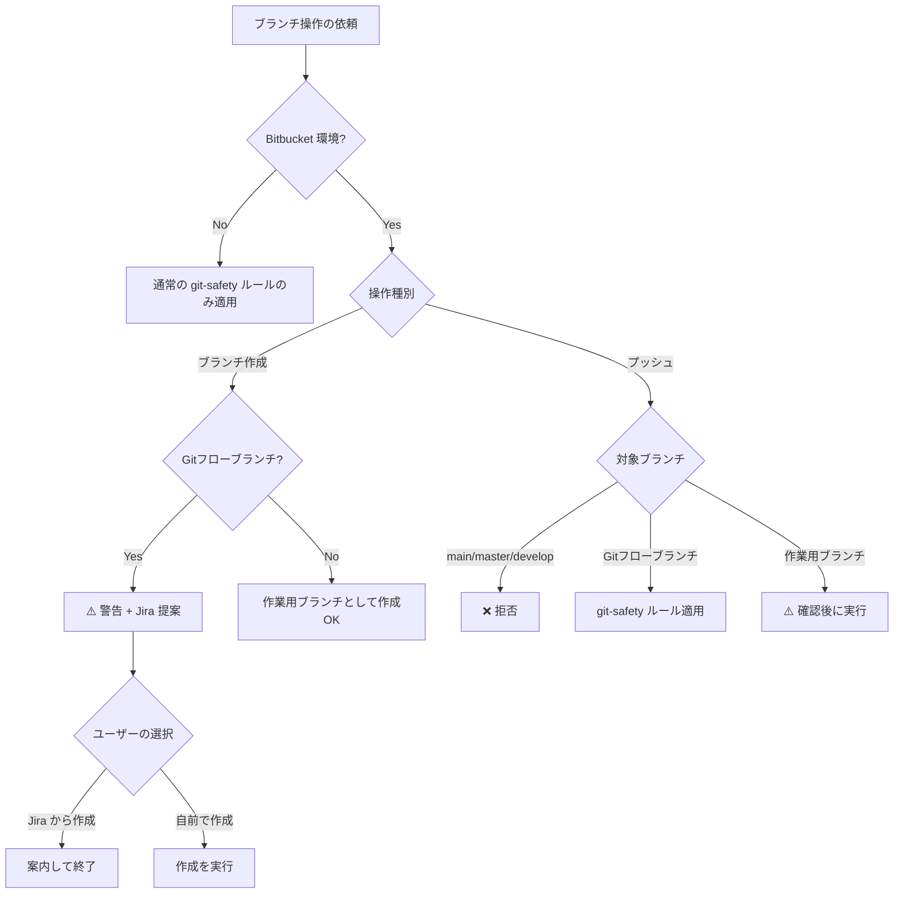

# Bitbucket 環境の Git ブランチ運用ルール

Bitbucket をリモートリポジトリとして使用する環境での、ブランチ作成・プッシュに関するルールを定義する。

## 適用条件

リモートリポジトリが Bitbucket（`bitbucket.org` または Bitbucket Server）の場合に適用する。

```powershell
git remote -v   # URL に bitbucket が含まれるか確認
```

## ブランチ作成ルール

### 1. Gitフローブランチの自動作成禁止

**Gitフローブランチ（develop / feature / bugfix / hotfix / release）はユーザーに Jira での作成を提案すること**。以下が該当パターン:

| ブランチ種別 | パターン例 |
|:---|:---|
| develop | `develop`, `develop/*` |
| feature | `feature/*` |
| bugfix / hotfix | `bugfix/*`, `hotfix/*`, `bug/*` |
| release | `release/*` |

**理由**: develop ブランチは Bitbucket から直接、feature/bugfix 等のブランチは Jira の issue 画面から作成する運用になっている。

### 2. Gitフローブランチの作成を依頼された場合

ユーザーが Gitフローブランチの作成を依頼した場合、以下の手順で対応する:

1. **日本語で警告を表示する**:

   > [!WARNING]
   > Bitbucket 環境では、feature/bugfix 等のブランチは Jira の issue 画面から作成する運用です。

2. **Jira issue からの作成を提案する**:

   > Jira の課題画面からブランチを作成することを推奨します。課題キー（例: PROJ-123）があれば、Jira 側での作成をご案内できます。

3. **ユーザーがそれでも自前で作ることを選択した場合**:
   - ユーザーの選択に従い、ブランチを作成する
   - ただし作成後もプッシュ時のルール（後述）は適用される

### 3. 作業用ブランチの作成

ローカル作業用のブランチは作成してよい。**ローカル作業用ブランチはプッシュ前に必ずユーザーの確認を取ること**（後述のプッシュルール参照）。

例:
- `wip/experiment-xyz`
- `tmp/debug-issue`
- `local/refactor-test`

## プッシュルール

### 4. 保護ブランチへのプッシュ拒否

以下のブランチへのプッシュは **理由を問わず拒否する**（確認も行わない）:

| ブランチ | パターン |
|:---|:---|
| main | `main` |
| master | `master` |
| develop | `develop` |

拒否メッセージ:

> [!CAUTION]
> `main` / `master` / `develop` ブランチへの直接プッシュは運用ルール上禁止されています。この操作は実行できません。

### 5. 作業用ブランチのプッシュ確認

作業用ブランチ（wip、tmp、local 等）をプッシュしようとした場合:

1. **日本語で確認する**:

   > [!WARNING]
   > 作業用ブランチ `<branch-name>` をリモートにプッシュしようとしています。運用上、作業用ブランチはプッシュしないことが推奨されています。本当にプッシュしてよいですか？

2. ユーザーが「はい」と回答した場合 → プッシュを実行する
3. ユーザーが「いいえ」と回答した場合 → プッシュを中止する

## 判定フロー



