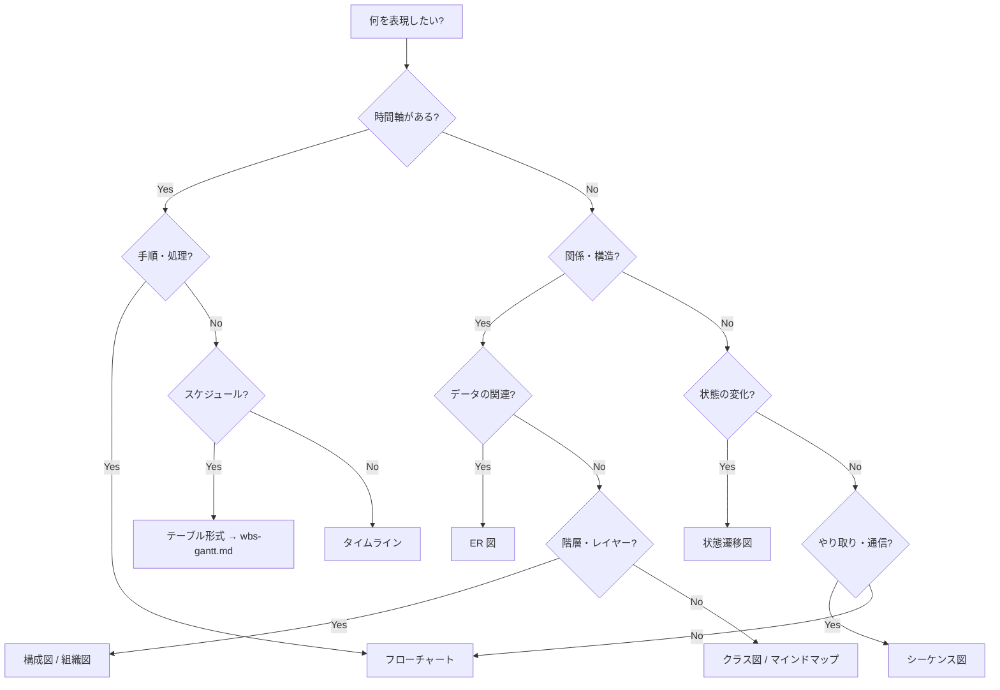
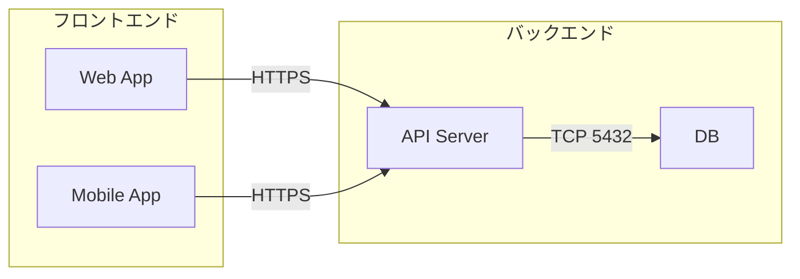

# 図解ドキュメント作成ガイド

図の作成・ドキュメント化のためのガイド。
Mermaid の具体的な書き方は `mermaid-examples.md` を参照する。

## 図の種類の選び方

ユーザーが具体的な図名を指定していない場合、**何を表現したいか**から最適な図を判断する。

| 表現したいこと | 推奨する図 | Mermaid 宣言 |
|---|---|---|
| 手順・業務の流れ・処理フロー | フローチャート | `flowchart TD` / `LR` |
| 分岐・意思決定 | フローチャート（判定ノード付き） | `flowchart TD` |
| システム間の通信・API のやり取り | シーケンス図 | `sequenceDiagram` |
| テーブル間の関連・データ構造 | ER 図 | `erDiagram` |
| ステータスの変化・承認ワークフロー | 状態遷移図 | `stateDiagram-v2` |
| システムの構成・レイヤー構造 | アーキテクチャ図 | `flowchart` + `subgraph` |
| ネットワーク・インフラ構成 | ネットワーク図 | `flowchart` + `subgraph` |
| クラス・モジュールの関係 | クラス図 | `classDiagram` |
| 時系列のイベント・沿革 | タイムライン | `timeline` |
| アイデアの整理・ブレスト | マインドマップ | `mindmap` |
| プロジェクトのスケジュール | テーブル形式（→ `wbs-gantt.md` 参照。HTML 変換時に CSS ガントチャートが自動生成） | — |
| 組織体制・レポートライン | 組織図 | `flowchart TD` |
| 循環するプロセス | サイクル図 | `flowchart` で循環リンク |
| Git ブランチ戦略 | Gitgraph | `gitGraph` |
| 割合・比率 | 円グラフ | `pie` |

### Mermaid で表現できない図

以下の図は Mermaid では表現できない。代替手段を提案する。

| 図の種類 | 代替手段 |
|---|---|
| ベン図 | テキスト + リストで共通部分と差分を整理する |
| ピラミッドチャート | 見出しの階層 + インデントで表現する |
| インフォグラフィック | Markdown の範囲外 — デザインツールの使用を提案する |

### 判断に迷う場合のフロー



> [!TIP]
> ユーザーが「こんな資料を作りたい」と抽象的に依頼してきた場合、このフローに沿って最適な図を提案する。複数の図を組み合わせることも有効（例: アーキテクチャ図 + シーケンス図）。

## 図解ドキュメントの基本構成

```markdown
# [図のタイトル]

## 概要

[この図が何を表しているか 1〜2 文で]

## 図

[Mermaid コードブロック]

## 構成要素の説明

| 要素 | 説明 |
|---|---|
| [要素名] | [役割・責務] |

## 補足

[図だけでは伝わらない背景や制約]
```

## 種別ごとの構成パターン

### フローチャート（業務フロー・処理フロー）

- `flowchart LR`（左→右）: 直線的なフロー向き
- `flowchart TD`（上→下）: 分岐が多い場合向き
- 分岐条件は `{}` で表現し、Yes/No ラベルを付ける

用途: 業務フロー、承認プロセス、エラーハンドリング、判定ロジック

### シーケンス図（通信・やり取り）

- 登場人物（participant）に日本語エイリアスを付ける
- ループや条件分岐は `loop`, `alt` ブロックで表現する
- メッセージは `->>` （同期）と `-->>` （非同期/レスポンス）を使い分ける

用途: API 通信フロー、ユーザー操作の流れ、システム間連携

### アーキテクチャ図・ネットワーク図（システム構成）

- `flowchart` + `subgraph` でレイヤーやグループを区切る
- 外部サービスと内部サービスを視覚的に分離する
- 通信プロトコルやポートをラベルに書く



用途: システム構成図、インフラ構成、デプロイ構成、ネットワーク構成

### ER 図（データモデル）

- `erDiagram` を使う
- リレーションの向きとカーディナリティを明示する
- 属性にはデータ型を付ける

用途: データベース設計、エンティティ関連の説明

### 状態遷移図

- `stateDiagram-v2` を使う
- 開始（`[*]`）と終了を明示する
- 遷移のトリガー（イベント）をラベルに書く

用途: ステータス管理、ワークフロー状態、承認フロー

### マインドマップ

- `mindmap` を使う
- 中心テーマから枝分かれさせる
- 深さは 3〜4 階層まで

用途: アイデア整理、ブレインストーミング、概念の整理

### 組織図

- `flowchart TD` を使い、上から下への階層構造で表現する
- 部門やチームは `subgraph` で囲む

用途: 組織体制、レポートライン、チーム構成

### タイムライン

- `timeline` を使う
- 時系列に沿ってイベントを並べる

用途: プロジェクト沿革、マイルストーン一覧、リリース履歴

## 図解ドキュメント固有のルール

- 図の**前**に概要を、図の**後**に構成要素の説明を置く
- 1 つのドキュメントに図が 3 つ以上ある場合は冒頭に目次を付ける
- 図が複雑になりすぎる場合は、詳細図と概要図に分割する
- コードブロックは図（Mermaid）以外では原則不要
- 図だけで完結させず、必ずテキストで補足説明を添える
