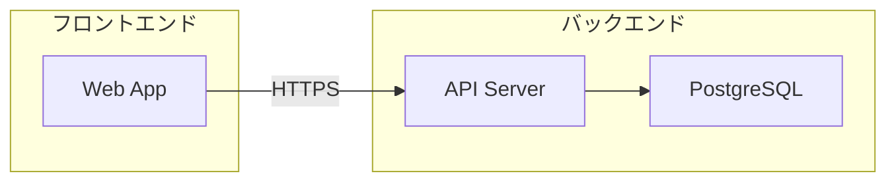

# 議事録作成ガイド

## HTML 変換を前提とした frontmatter

md-to-html スキルで HTML に変換する場合は、YAML frontmatter に `type: minutes` を付与する。
HTML 変換時に参加者タグ・決定事項リスト・アクション項目など議事録固有のコンポーネントが適用される。

```yaml
---
type: minutes
title: 会議名
date: YYYY-MM-DD
---
```

## 議事録テンプレート

```markdown
# [会議名] 議事録

- **日時**: YYYY-MM-DD HH:MM〜HH:MM
- **場所**: [会議室名 / オンライン（Teams 等）]
- **参加者**: [名前1、名前2、名前3]
- **記録者**: [名前]

## 議題

### 1. [議題1]

[議論の要約 — 何が話され、何が結論になったか]

<details>
<summary>議論の詳細</summary>

[発言記録、図解、共有された資料の内容など]

</details>

### 2. [議題2]

[議論の要約]

## 決定事項

| No. | 決定内容 | 担当 | 期限 |
|---:|---|---|---|
| 1 | [内容] | [担当者] | YYYY-MM-DD |
| 2 | [内容] | [担当者] | YYYY-MM-DD |

## TODO

- [ ] [タスク内容] — 担当: [名前] / 期限: YYYY-MM-DD
- [ ] [タスク内容] — 担当: [名前] / 期限: YYYY-MM-DD

## 次回予定

- **日時**: YYYY-MM-DD HH:MM〜
- **議題（予定）**: [次回の議題]
```

## 議論の詳細の書き方

各議題の要約の直後に `<details>` で折りたたんで記録する。普段は要約だけ読めば十分で、詳細が必要な場面（経緯の確認、認識合わせ等）で開く。

### 詳細に含められる内容

| 内容 | 書き方 |
|---|---|
| 発言記録 | `> [名前]: 発言内容` |
| 図解（構成図・フロー等） | Mermaid コードブロック |
| ホワイトボードの内容 | テキスト化 + 必要なら Mermaid で再現 |
| 共有された数値・データ | テーブル |
| コード・設定値 | コードブロック（言語名指定） |

### 詳細の記述例

```markdown
### 1. 新システムの構成検討

API サーバーを中心に、フロントエンドとデータベースを分離する構成に決定。

<details>
<summary>議論の詳細</summary>

> [田中]: フロントエンドとバックエンドを分離した方が将来的にスケールしやすい
> [佐藤]: DB は PostgreSQL でよいか？
> [田中]: 今回の要件なら PostgreSQL で十分

合意した構成:



</details>
```

### 詳細が不要な場合

すべての議題に詳細を書く必要はない。以下の場合は要約のみで十分:

- 報告・共有のみで議論がなかった場合
- 決定事項テーブルに書けば十分な場合
- 全員の認識が一致しており経緯の記録が不要な場合

## 議事録固有のルール

### 見出し構成

- `#` は会議名（1 つだけ）
- `##` は固定セクション（議題、決定事項、TODO、次回予定）
- `###` は各議題

### 記述のポイント

- **逆ピラミッド構造**: 決定事項と TODO を先に書き、議論の経緯は後に置く
  - 読み手は「何が決まったか」「自分は何をすべきか」を最初に知りたい
- 発言者の引用が必要な場合は `> [名前]: 発言内容` の形式を使う
- コードブロックは原則不要 — 技術的な議論でコードが出た場合のみ使う

### 決定事項テーブル

- No. 列は右寄せ（`---:`）
- 担当と期限は必ず埋める — 未定の場合は「未定」と明記する

### TODO リスト

- チェックボックス（`- [ ]`）形式を使う
- 各 TODO に**担当者**と**期限**を併記する
