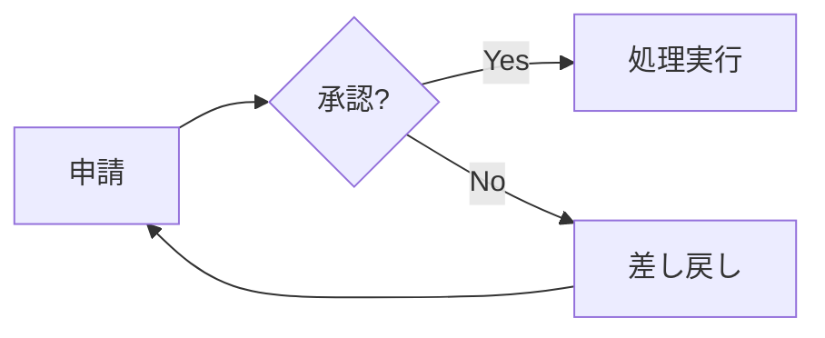
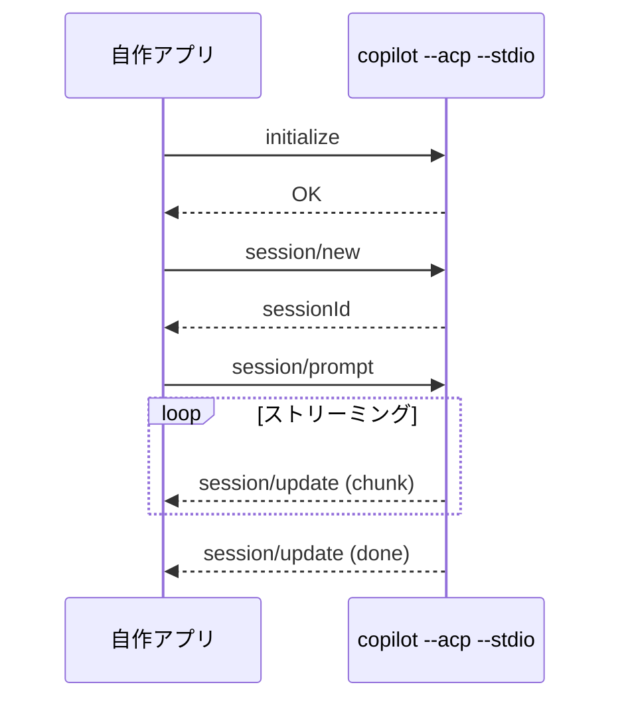
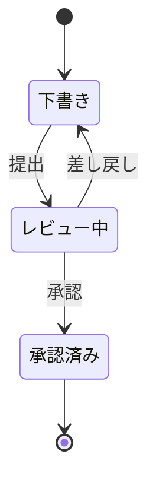

# Mermaid 図解リファレンス

## 図解すべき場面と Mermaid 図の種類

| 場面 | 使う図の種類 | Mermaid 宣言 |
|---|---|---|
| 業務フロー・処理フロー | フローチャート | `flowchart LR` / `flowchart TD` |
| API 呼び出し・通信の流れ | シーケンス図 | `sequenceDiagram` |
| 状態遷移・ステータス管理 | 状態遷移図 | `stateDiagram-v2` |
| クラス設計・データモデル | クラス図 | `classDiagram` |
| プロジェクト計画・WBS | テーブル形式で記述（HTML 変換時に CSS ガントチャートが自動生成される） | — |
| システム構成・依存関係 | フローチャート or クラス図 | `flowchart` / `classDiagram` |
| 意思決定・分岐 | フローチャート | `flowchart TD` |
| 時系列のイベント | タイムライン | `timeline` |
| Git ブランチ戦略 | Gitgraph | `gitGraph` |
| ER 設計 | ER 図 | `erDiagram` |

## 書き方の例

**フローチャート（業務フロー）:**



**シーケンス図（API 通信）:**



**状態遷移図:**



## Mermaid 図解のルール

- ` ```mermaid ` コードブロックで囲む
- ラベルは日本語を積極的に使ってよい
- 図の前後に簡単な説明文を添える
- 図の種類に迷ったら、まず **flowchart** か **sequenceDiagram** を検討する
