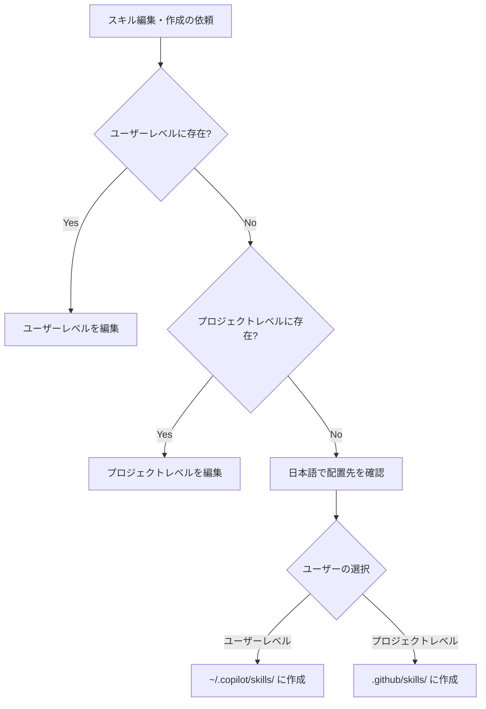

# スキルの探索・配置ルール

## 対象ファイル探索ルール

スキルの編集・更新・新規作成の依頼があった場合、以下の順序でファイルを探索し対象を決定する。

### 探索順序

| 優先順位 | 探索先 | パス |
|:---|:---|:---|
| 1 | ユーザーレベル | `C:\Users\<User>\.copilot\skills\<skill-name>\SKILL.md` |
| 2 | プロジェクトレベル | `<project-root>\.github\skills\<skill-name>\SKILL.md` |

> [!NOTE]
> `<User>` は現在のユーザー名に置換する（`$env:USERNAME` または `$env:USERPROFILE` から取得）。

### 既存スキルの編集

1. **ユーザーレベルに存在する場合** → そこを編集対象とする
2. **ユーザーレベルに存在せず、プロジェクトレベルに存在する場合** → プロジェクトレベルを編集対象とする

### 新規スキルの作成

探索の結果どちらにも存在しない場合（＝新規作成）、**日本語で配置先を確認する**:

> このスキルは新規作成になります。どちらに配置しますか？
> - **ユーザーレベル**（`~/.copilot/skills/`）— すべてのプロジェクトで利用可能
> - **プロジェクトレベル**（`.github/skills/`）— このプロジェクト専用



## デプロイ手順

1. プロジェクトレベルに作成: `.github/skills/<name>/SKILL.md`
2. 必要に応じてユーザーレベルにもコピー:
   ```bash
   cp -r .github/skills/<name> ~/.copilot/skills/
   ```
3. プロジェクト固有のスキルはプロジェクトレベルのみに配置する
4. 汎用的なスキルはユーザーレベルにも配置する

> [!TIP]
> ユーザーレベルに配置したスキルは、すべてのプロジェクトで利用できる。
